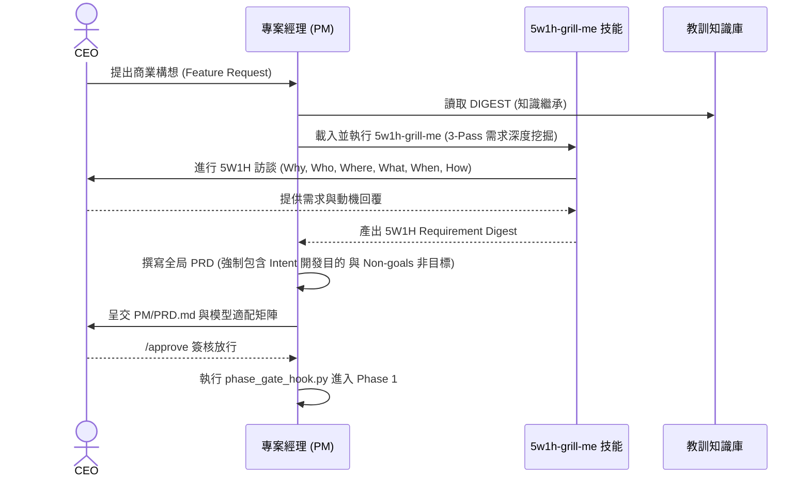
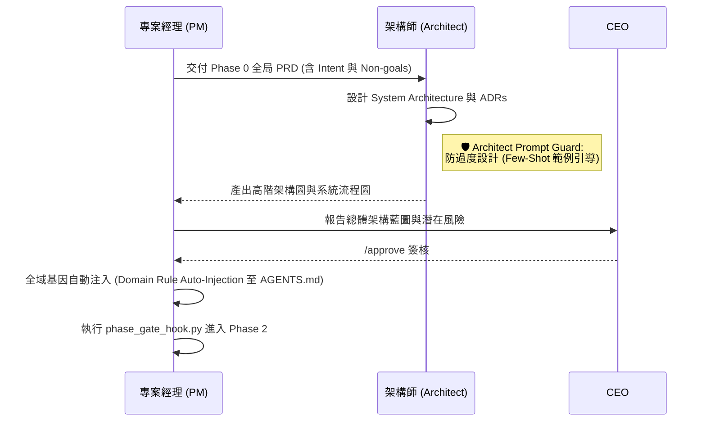
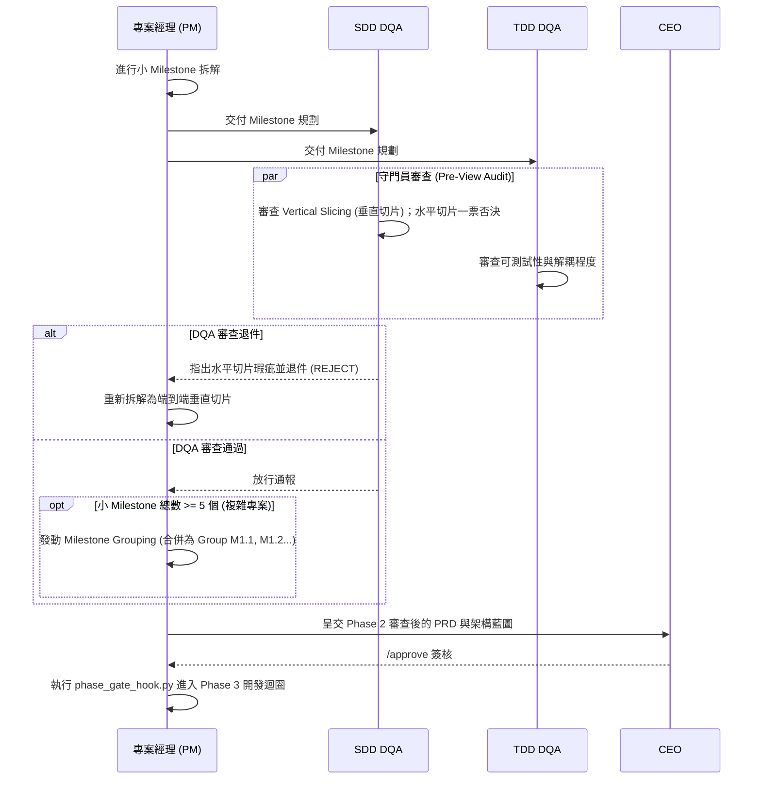
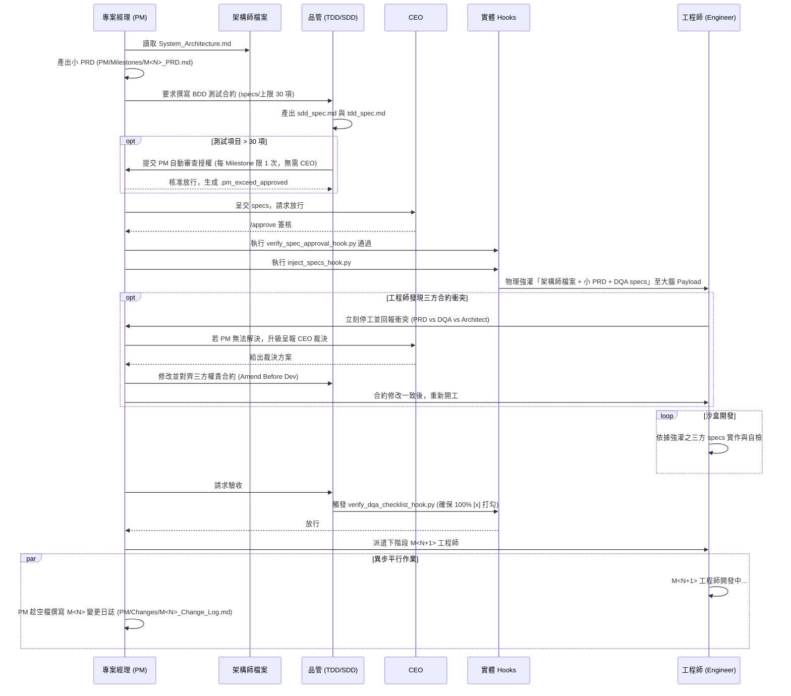
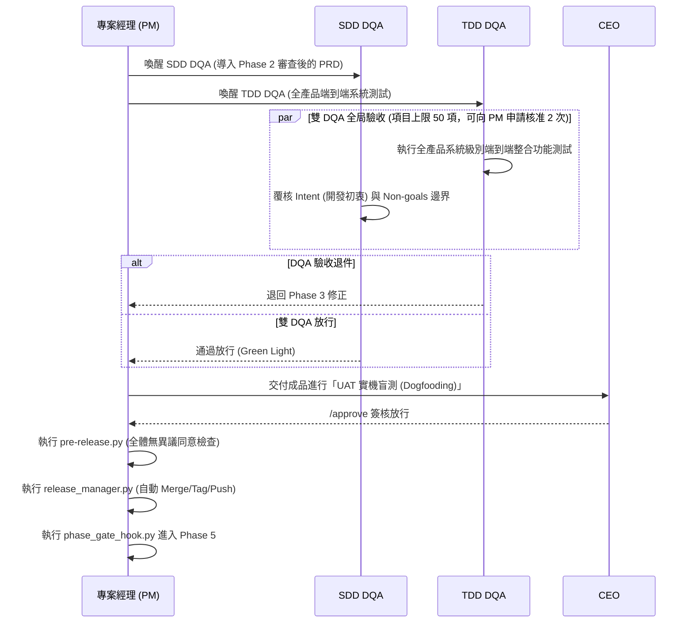
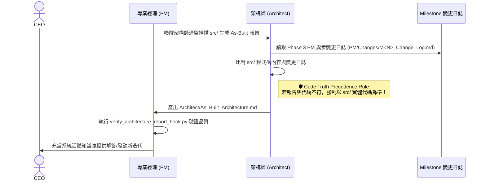
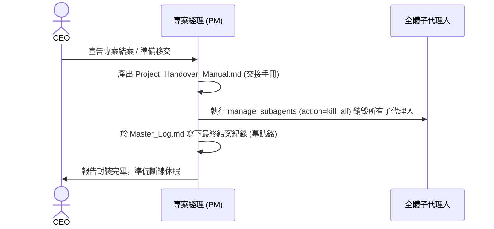

# 🚀 Johnny-Project-Team Plugin
**專為「非技術背景領導者」打造的企業級 AI 專案開發大腦**

[](https://github.com/google/antigravity) 
[](https://opensource.org/licenses/MIT)

> **💡 什麼是 Johnny-Project-Team？**
> 這不是一個單純寫程式的 AI 助理，而是一個**「完整的虛擬軟體開發團隊」**。
> 本工作流程以 **Google Antigravity** 作為核心專案管理與高階決策中樞。

---

## 🎯 核心設計理念：讓「邏輯」與「工程」完美分工

這個 Plugin 的核心目的是給**沒有軟體工程背景的人**一個有效且穩固的開發流程。

背後的邏輯是：您不一定懂怎麼寫 Code，但您一定具備邏輯判斷與做商業選擇的能力。就像真實世界的 CEO 不一定懂所有的工程細節，但他能在關鍵時刻給出大方向，並用邏輯判斷專案能否繼續推進。

因此，本系統具備以下特點：
* **🧠 選擇題驅動，絕不塞炸彈**：這裡的 PM (專案經理) **絕對不會直接將工程問題塞給您**。PM 會在內部深度思考後，向您提出具體的「選項與建議 (Options & Recommendations)」。
* **🗺️ 視覺化決策輔助**：在每一個開發 Milestone (里程碑) 結束時，系統會產出清晰的**流程圖**與**資料流向圖**供您 Review。
* **🛡️ 動態基因加載 (ECC 防禦)**：系統會自動根據您的**程式架構動態加載 Rule (規則)**。透過類似 ECC (Error Correction Code) 的機制，避免工程開發重複踩坑。

既然 LLM 已經具備了海量的專業知識，我們要做的只是**將流程與角色定義好，把專業的事情交給 AI**。讓 AI 協助您思考、幫您寫 Code，並做好嚴密的品管把關。您唯一要做的，就是**給出方向，並決定在哪個時間點參與驗證 (Human-in-the-loop)**。

---

## 🗺️ Vibe Coding 工作流程圖 (Workflow)

```mermaid
graph TD
    %% Define Styles
    classDef phase fill:#2c3e50,stroke:#34495e,stroke-width:2px,color:#fff;
    classDef ecc fill:#c0392b,stroke:#e74c3c,stroke-width:2px,color:#fff;
    classDef agent fill:#2980b9,stroke:#3498db,stroke-width:2px,color:#fff;
    classDef security fill:#f39c12,stroke:#f1c40f,stroke-width:2px,color:#fff;

    %% Phases
    Start((開始專案)) --> P0["Phase 0: 5W1H 戰略收斂<br/>(載入 5w1h-grill-me，擬定 Intent & Non-goals 全局 PRD)"]:::phase
    P0 -- "/approve" --> P1["Phase 1: 總體架構設計<br/>(Architect 防過度設計 Few-Shot + 全域基因 Rule Auto-Injection)"]:::phase
    P1 -- "/approve" --> P2["Phase 2: Milestone 拆解與 DQA 審查<br/>(Skills-to-Tickets 垂直切片 + 複雜專案 Milestone Grouping)"]:::phase
    
    P2 -- "/approve" --> P3Enter
    
    subgraph P3 ["Phase 3: 實作與驗收雙迴圈"]
        direction TB
        P3Enter[PM 讀取架構圖並產出小 PRD] --> DQA_Spec["DQA 撰寫 BDD 測試合約<br/>(specs/ 含 Checklist, 上限 30 項)"]:::agent
        DQA_Spec -- "超過 30 項" --> PM_Review{"PM 內部自動審查放行<br/>(每 Milestone 限 1 次)"}:::ecc
        PM_Review -- 放行 (.pm_exceed_approved) --> ApproveGate
        DQA_Spec -- "<= 30 項" --> ApproveGate
        ApproveGate["CEO 簽核放行<br/>(verify_spec_approval_hook)"] --> Inject["三方上下文物理強灌 Payload<br/>(inject_specs_hook)"]:::ecc
        Inject --> ConflictCheck{"三方合約衝突檢查<br/>(PRD / DQA / Architect)"}
        ConflictCheck -- "發現衝突" --> AmendDev["修合約再開工<br/>(Amend Before Dev Protocol)"]:::ecc
        AmendDev --> Inject
        ConflictCheck -- "無衝突" --> Eng[Engineer Agent 沙盒開發]:::agent
        Eng --> Shield{"AgentShield Hook<br/>(攔截高危指令/密碼)"}:::security
        Shield -- 失敗 (Autofix) --> Eng
        Shield -- 通過 --> Smoke[工程師自檢編譯]
        Smoke --> DQA_Check["DQA 物理勾選驗收<br/>(verify_dqa_checklist_hook)"}:::ecc
        DQA_Check -- "[ ] 未打勾退回" --> Eng
        DQA_Check -- "[x] 100% 打勾" --> Claude["Claude DQA 外部獨立審查"]:::agent
        Claude -- 退回 --> Eng
        Claude -- 通過 --> ChangeLog["PM 異步撰寫上一階段變更日誌<br/>(Parallel Change Log Generation)"]:::agent
    end
    
    ChangeLog --> CheckMilestone{"Milestones<br/>全部完成?"}
    CheckMilestone -- 否 (進入下個 Milestone) --> P3Enter
    CheckMilestone -- 是 (全部完工) --> P4["Phase 4: 全局驗收與發布上線<br/>(Phase 2 審查 PRD + 雙 DQA 全產品測試 + UAT 盲測)"]:::phase
    
    P4 -- "/approve & pre-release.py" --> P5["Phase 5: 產品上線後維護與迭代<br/>(As-Built 架構快照 + 真實代碼優先原則)"]:::phase
    P5 -- "宣告結案" --> P6["Phase 6: 專案封裝與退場<br/>(交接手冊 + kill_all 資源釋放 + 休眠)"]:::phase
    P6 -- "/approve" --> End((專案休眠))
    
    %% Continuous Learning Flow (Any Phase)
    subgraph ECC ["持續學習與防禦迴圈 (Continuous Learning)"]
        ErrorEvent((踩坑/教訓產生)) --> Propose[教訓 Proposal]
        Propose --> VerifyHook{verify_lesson_hook.py}:::ecc
        VerifyHook --> DB[("全球知識庫<br/>.agents/lessons_learned/DIGEST.md")]
    end
    
    %% Connections for Learning
    Eng -.踩坑.-> ErrorEvent
    DB -."Phase 0/1 喚醒時載入".-> P0
```


### 🔍 各階段詳細作業流程 (Detailed Phase Workflows)

<details>
<summary><b>Phase 0: 5W1H 戰略定義與全局 PRD (點擊展開)</b></summary>


</details>

<details>
<summary><b>Phase 1: 總體架構設計與基因注入 (點擊展開)</b></summary>


</details>

<details>
<summary><b>Phase 2: Milestone 拆解與 DQA 垂直切片審查 (點擊展開)</b></summary>


</details>

<details>
<summary><b>Phase 3: 實作與驗收雙迴圈 (點擊展開)</b></summary>


</details>

<details>
<summary><b>Phase 4: 全局驗收與發布上線 (點擊展開)</b></summary>


</details>

<details>
<summary><b>Phase 5: 產品上線後維護與迭代 (點擊展開)</b></summary>


</details>

<details>
<summary><b>Phase 6: 專案封裝與退場 (點擊展開)</b></summary>


</details>

---

## 🌟 核心特色 (Core Features)

### 1. 🛡️ 鐵律與物理防爆沙盒 (Physical Guardrails)
我們不依賴 AI 的「道德勸說」，而是從系統底層進行**物理封鎖**：
* **目錄隔離防線 (`path_guard`)**：工程師 AI 被物理限制只能在 `src/` (源碼) 目錄下寫扣，絕對無法偷改您的系統配置或專案核心大腦。
* **發布權限沒收 (`git_guard`)**：工程師 AI **沒有**上版權限 (`git commit`)。所有代碼變更都必須經過您 (CEO) 的點頭，才能正式寫入專案版本中。
* **DQA 三重鎖定與視覺閘門 (`phase_gate_hook`)**：若未集齊 TDD、SDD 與 Claude 的全數綠燈，或 PM 未依規定產出系統架構圖與資料流向圖，系統將亮紅燈強制鎖死，絕對禁止向 CEO 請求 `/approve`。

### 2. 🚦 階段閘門制 (Phase Gates)
專案不會一開始就亂寫程式。我們強制導入中大型專案必備的 5 大階段：
1. **Phase 0 (戰略定義)**：與您對齊商業目標與需求規格 (PRD)。
2. **Phase 1 (架構設計)**：規劃軟體藍圖，決定要使用什麼技術。
3. **Phase 2 (測試驅動開發 TDD/SDD)**：在寫任何一行功能前，DQA (品管) 會先寫好測試與檢查標準。
4. **Phase 3 (實作與封裝)**：工程師在安全的沙盒中進行開發。
5. **Phase 4 (成品驗收階段)**：統整本次開發的經驗並執行最終實機盲測，自動封裝發布。
6. **Phase 5 (產品上線後維護)**：專案經理化身活體知識庫，準備觸發新一輪迭代。
7. **Phase 6 (專案封裝與退場)**：統整血淚史產出交接手冊，強制終止並釋放所有運算資源。

> **🛑 防偷渡機制**：任何階段的切換，都必須由您親自輸入 `/approve` 授權，AI 絕對無法私自跳關！

### 3. 👥 多代理人制衡 (Multi-Agent Check & Balance)
本外掛自動內建多個原生 AI 角色，互相監督：
* **PM (專案經理)**：負責跟您溝通，把商業需求翻譯給工程師聽。
* **Architect (架構師)**：負責把關系統不要越寫越肥大。
* **DQA (品管與審查陣列)**：包含 TDD (理科，看邏輯與邊界)、SDD (文科，看體驗與商業需求) 以及 Claude (外部模型防偽審查)，三管齊下確保工程師沒有偷懶。
* **Security DQA (資安特種部隊)**：融合應用層漏洞、供應鏈與網路架構掃描能力。專屬於高敏感功能的外掛品管，可由 PM 手動喚醒。
* **TE (測試工程師)**：擁有**零寫入權限**的純淨觀察者，確保測試報告絕對客觀。

#### 🤖 模型與角色適配推薦矩陣 (Model Recommendation Matrix)
在專案初期 (Phase 0)，PM 會為下列預設代理人分配最適合的模型與思考層級，並交由 CEO 簽核：

| 角色名稱 (Role) | 設定檔位置 | 角色作用 (Description) |
| :--- | :--- | :--- |
| **PM (主控端)** | `skills/Johnny-project-team/SKILL.md` | 專案大腦。負責流程控管、需求拆解、指揮調度其他子代理人，並負責與 CEO 溝通。 |
| **Architect** | `agents/architect.json` | 系統架構師。負責決定技術棧、畫出架構圖，以及制定開發規範。 |
| **Engineer** | `agents/engineer.json` | 核心開發者。負責根據架構圖與 PRD 進行具體的程式碼實作。 |
| **TDD DQA** | `agents/tdd_dqa.json` | 理科品管。負責撰寫單元/E2E測試，嚴格審查極端邊界，並確保覆蓋率。 |
| **SDD DQA** | `agents/sdd_dqa.json` | 文科品管。負責核對實作是否符合 PRD 業務邏輯，並進行 UX/UI 審查。 |
| **Security DQA** | `agents/security_dqa.json` | 資安品管 (外掛)。負責高敏感功能之漏洞掃描、供應鏈盤點與越權防護。 |
| **Claude DQA** | `claude` CLI | 外部獨立審查員。透過不同模型架構進行防偽與交叉驗證抓漏。 |

### 4. 🧰 內建擴充技能包 (Built-in Skills)
除了專案經理主技能外，Plugin 還內建了多個強大的輔助技能，全方位強化專案體質：
* **5W1H 需求深度盤問 (`5w1h-grill-me`)**：結合 5W1H 框架 (Why, Who, Where, What, When, How) 的專業需求盤問技能。在 Phase 0 透過 3-Pass 盤問協定反通靈並強勢收斂 5W1H 需求規格。
* **Claude 外包指揮官 (`claude-executor-orchestrator`)**：能把 Claude Code CLI 當成外包部隊指揮。當有繁雜的實作任務時，PM 會把任務打包外包給 Claude，並強制產出交接報告。
* **教訓知識庫維護 (`lesson-maintainer`)**：定期整理、去重與去噪教訓知識庫 (`.agents/lessons_learned/DIGEST.md`)，並將高頻教訓自動升級為組織的強固規則。

### 5. 📚 自動進化教訓庫 (Lesson Learnt Registry)
人會犯錯，AI 也會。但這個系統「不會犯第二次錯」。
每次遇到 BUG 或架構問題，系統會自動歸納成「防呆 SOP」，並永久寫入專案基因 (`.agents/lessons_learned/DIGEST.md`)。未來的新任務都會強制讀取這些教訓，讓專案越做越穩！

### 6. 📝 日誌與追溯機制 (Logging & Observability)
專案配備了專屬的 **Log Agent (日誌與觀測代理人)**，它不寫程式，只負責監控團隊的健康度並將紀錄儲存：
* **指標化日誌 (Pointer-Based Logging)**：為防止大腦記憶體超載或外洩機密，主日誌絕對**不紀錄**冗長程式碼、原始錯誤堆疊 (Stack Trace) 或敏感金鑰。詳細的錯誤會被封裝在獨立的 Markdown 報告中 (如 `/dqa_reports/bug_123.md`)，主日誌只會留下簡短摘要與檔案超連結。
* **主要紀錄檔案位置**：
  * 📜 **主編年史**：`Logs/Master_Log.md` (記錄每次 Milestone 完成、失敗退件、或 CEO 簽核的關鍵節點，並附帶紅綠燈儀表板與花費估算)。
  * 🧠 **記憶壓縮檔**：`PM/Memory/M<N>_Digest.md` (由 PM 在每次 Milestone 結束後產出的 800 字以內摘要，避免大腦幻覺)。
  * 📖 **全局教訓庫**：`.agents/lessons_learned/DIGEST.md` (由系統自動萃取的所有踩坑教訓，成為後續開發的強制規則)。

### 7. 💾 自動備份與收工存檔機制 (Auto-Backup & Save)
本系統具備嚴格的檔案保護機制。當您準備結束一天的開發工作 (說出「收工」或準備關閉終端機時)：
* **全自動無感備份**：每當系統內的任何 Agent 修改了 Plugin 或 Skill 底下的設定檔、腳本或系統提示詞，Agent 都會被全局鐵律強制觸發備份腳本 (`backup_skill.py`)。
* **CEO 隨時掌握進度**：無需手動執行繁瑣的備份指令，您的每一次修改都會被自動同步到 Personal Skills editor workspace 中，確保知識資產零流失。

---

## 🛠️ 依賴與前置需求 (Prerequisites)
為了讓整套「物理防爆沙盒」與「自動化工作流」順利運行，您的電腦必須安裝以下外部套件：

### 核心必備 (Required)
1. **[Google Antigravity](https://github.com/google/antigravity)**：本工作流程的宿主 (Host) 與高階決策中樞。
2. **[Git](https://git-scm.com/)**：用於版本控制與 `release_manager.py` 自動上版。
3. **[Docker](https://www.docker.com/)**：**【絕對必要】** 用於 TDD DQA 在完全隔離的虛擬貨櫃中執行測試，嚴格防止 AI 惡意代碼破壞您的本機環境。
4. **[Python 3.8+](https://www.python.org/)**：用於執行系統底層的各種安檢閘門與防禦腳本 (如 `agent_shield_hook.py`, `verify_lesson_hook.py`)。

### 外部打工部隊 (Highly Recommended)
* **[Claude Code CLI](https://docs.anthropic.com/en/docs/agents-and-tools/claude-code/overview)** (`npm install -g @anthropic-ai/claude-code`)：用於 Phase 3 的「Claude DQA 最終抓漏防線」與外包實作任務。本系統會透過終端機自動呼叫它。

### 視覺審查輔助 (Optional)
* **`gstack` / `omniparser`**：若有安裝，SDD DQA 將能透過無頭瀏覽器與 UI 座標解析技術，精準執行視覺破版與對齊測試。(未安裝時將優雅降級為截圖目視審查)。

---

## 🚀 如何開始使用？ (How to Start)

1. **安裝 Plugin**
   將本目錄放入您的 Antigravity 環境中。
2. **啟動對話**
   對著 Antigravity 說：「我要開發一個全新的商城系統」。
3. **跟著 PM 走**
   接下來，您只需要像個老闆一樣，回答 PM 的問題。PM 會主動提供「選擇題 (方案 A/B/C)」，您只要負責決策，不需要懂任何一行程式碼。
4. **驗收與核准**
   看到 PM 回報進度並顯示 `User Review Required` 時，確認沒問題就輸入 `/approve` 放行。

---

## 📦 目錄結構導覽 (供進階使用者)
* `/skills`：存放所有自動化防護腳本 (如目錄防護、上下文壓縮、惡意代碼掃描)。
* `/agents`：存放所有子代理人的職位定義檔 (PM, Engineer, DQA)。
* `/references/phases`：SOP 與各階段的標準作業程序規範。

---

*Built for the future of Autonomous Software Development.*
