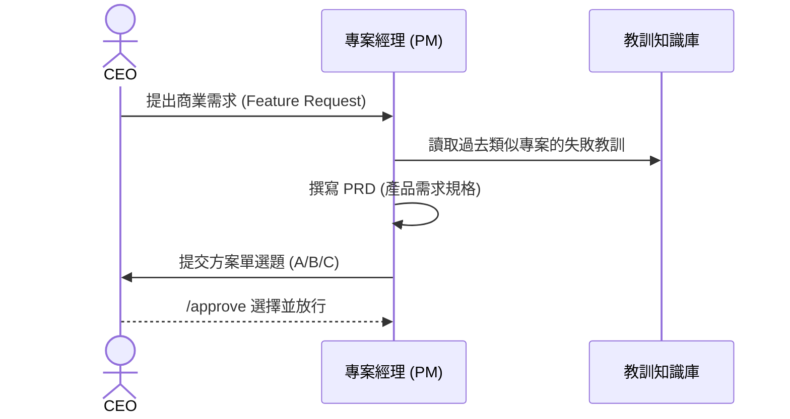
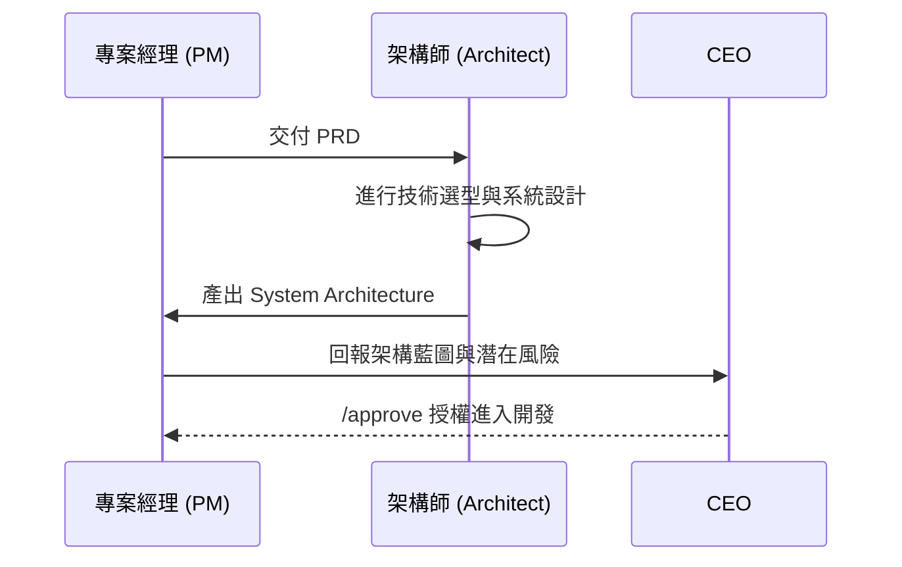
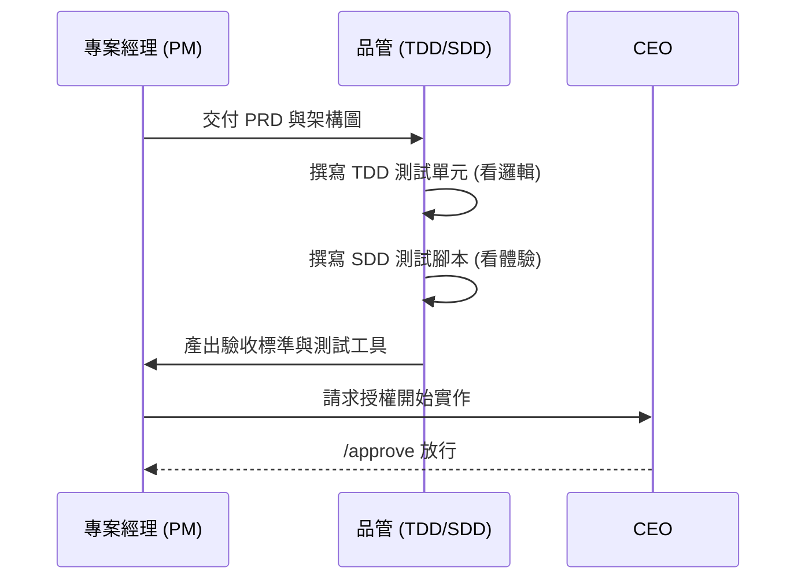
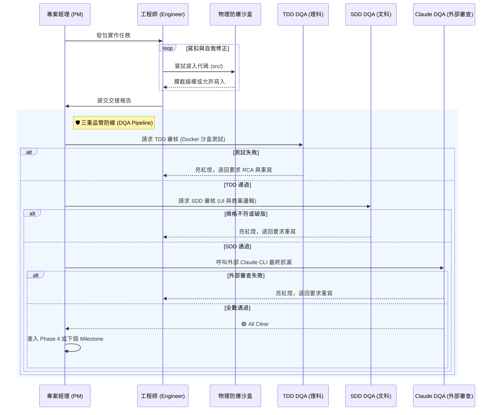
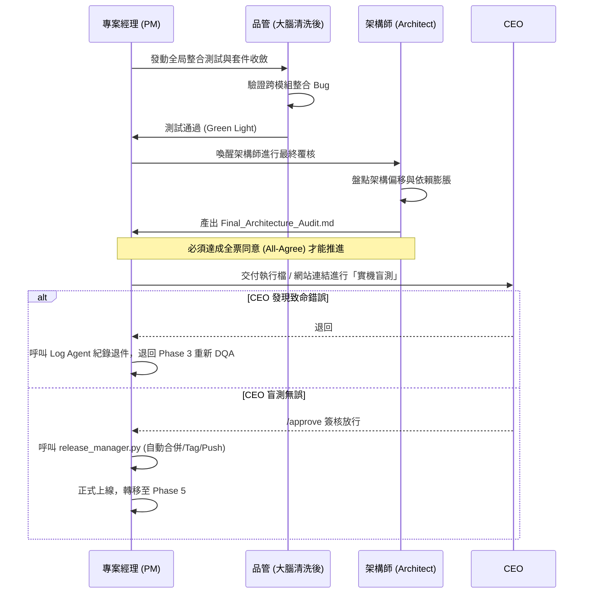
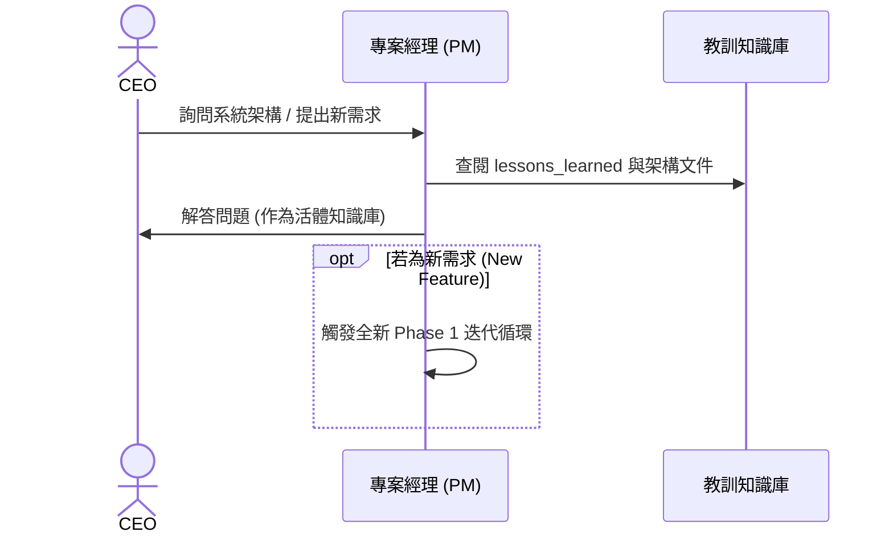
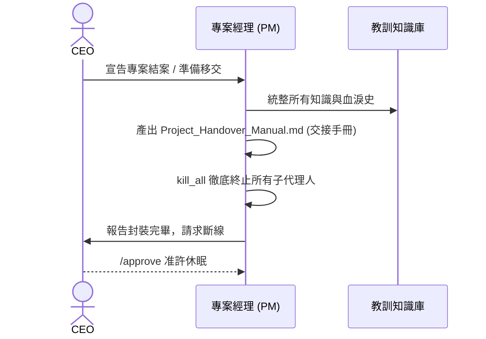

# 🚀 Johnny-Project-Team Plugin
**專為「非技術背景領導者」打造的企業級 AI 專案開發大腦**

[](https://github.com/google/antigravity) 
[](https://opensource.org/licenses/MIT)

> **💡 什麼是 Johnny-Project-Team？**
> 這不是一個單純寫程式的 AI 助理，而是一個**「完整的虛擬軟體開發團隊」**。
> 本工作流程以 **Google Antigravity** 作為核心專案管理與高階決策中樞，並強烈輔以 **Claude Code CLI** 作為強悍的底層代碼外包執行部隊。
> 
> 您只需要扮演 **CEO (決策者)**，向 Antigravity 提出您的商業需求；系統會自動喚醒專案經理 (PM)、架構師 (Architect)、品管測試員 (DQA) 與工程師 (Engineer)，並嚴格按照中大型專案的標準 SOP 進行開發與指揮 Claude 外包作業。

---

## 🎯 解決了什麼痛點？
在傳統的 AI 輔助開發中，沒有技術背景的人經常遇到以下噩夢：
* ❌ AI 寫扣毫無章法，越改越糟，最後整套系統崩潰。
* ❌ AI 為了完成任務，私自刪除重要的核心檔案。
* ❌ AI 不懂商業邏輯，寫出來的東西完全不能用。

**本 Plugin 透過「物理級防禦」與「階段閘門」徹底終結這些問題。**

---

## 🗺️ Vibe Coding 工作流程圖 (Workflow)

```mermaid
graph TD
    %% 角色定義
    CEO((CEO / 您))
    PM[專案經理 PM]
    ARCH[架構師 Architect]
    DQA[品管 DQA]
    ENG[工程師 Engineer]
    TE[測試工程師 TE]

    %% 流程
    CEO -- "下達商業需求" --> Phase0
    
    subgraph "Phase 0: 戰略定義"
        Phase0[產出 PRD 規格書] -.-> PM
    end
    Phase0 -- "需 CEO /approve 放行" --> Phase1
    
    subgraph "Phase 1: 架構設計"
        Phase1[產出系統架構與技術選型] -.-> ARCH
    end
    Phase1 -- "需 CEO /approve 放行" --> Phase2
    
    subgraph "Phase 2: 測試驅動開發"
        Phase2[撰寫 TDD/SDD 測試與驗收標準] -.-> DQA
    end
    Phase2 -- "需 CEO /approve 放行" --> Phase3
    
    subgraph "Phase 3: 實作與封裝 (物理沙盒)"
        Phase3[在 src/ 進行開發 (無 Commit 權限)] -.-> ENG
    end
    Phase3 --> Phase4
    
    subgraph "Phase 4: 驗收與教訓總結"
        Phase4[執行測試與紀錄 lessons_learned] -.-> TE
        Phase4 -.-> DQA
    end
    
    Phase4 -- "需 CEO /approve 發布" --> Release((正式上線))
    
    Release --> Phase5
    
    subgraph "Phase 5: 產品上線後維護"
        Phase5[活體知識庫與新迭代觸發] -.-> PM
    end
    
    Phase5 -- "CEO 宣告結案" --> Phase6
    
    subgraph "Phase 6: 專案封裝與退場"
        Phase6[產出交接手冊與釋放資源] -.-> PM
    end
    
    Phase6 --> Sunset((專案休眠))
    
    %% 樣式
    classDef phase fill:#f9f9f9,stroke:#333,stroke-width:2px;
    class Phase0,Phase1,Phase2,Phase3,Phase4,Phase5,Phase6 phase;
```

```

### 🔍 各階段詳細作業流程 (Detailed Phase Workflows)

<details>
<summary><b>Phase 0: 戰略定義 (點擊展開)</b></summary>


</details>

<details>
<summary><b>Phase 1: 架構設計 (點擊展開)</b></summary>


</details>

<details>
<summary><b>Phase 2: 測試驅動開發 (點擊展開)</b></summary>


</details>

<details>
<summary><b>Phase 3: 實作與封裝 (點擊展開)</b></summary>


</details>

<details>
<summary><b>Phase 4: 驗收與教訓總結 (點擊展開)</b></summary>


</details>

<details>
<summary><b>Phase 5: 產品上線後維護 (點擊展開)</b></summary>


</details>

<details>
<summary><b>Phase 6: 專案封裝與退場 (點擊展開)</b></summary>


</details>

---

## 🌟 核心特色 (Core Features)

### 1. 🛡️ 鐵律與物理防爆沙盒 (Physical Guardrails)
我們不依賴 AI 的「道德勸說」，而是從系統底層進行**物理封鎖**：
* **目錄隔離防線 (`path_guard`)**：工程師 AI 被物理限制只能在 `src/` (源碼) 目錄下寫扣，絕對無法偷改您的系統配置或專案核心大腦。
* **發布權限沒收 (`git_guard`)**：工程師 AI **沒有**上版權限 (`git commit`)。所有代碼變更都必須經過您 (CEO) 的點頭，才能正式寫入專案版本中。

### 2. 🚦 階段閘門制 (Phase Gates)
專案不會一開始就亂寫程式。我們強制導入中大型專案必備的 5 大階段：
1. **Phase 0 (戰略定義)**：與您對齊商業目標與需求規格 (PRD)。
2. **Phase 1 (架構設計)**：規劃軟體藍圖，決定要使用什麼技術。
3. **Phase 2 (測試驅動開發 TDD/SDD)**：在寫任何一行功能前，DQA (品管) 會先寫好測試與檢查標準。
4. **Phase 3 (實作與封裝)**：工程師在安全的沙盒中進行開發。
5. **Phase 4 (驗收與教訓總結)**：統整本次開發的經驗，升級專案大腦。

> **🛑 防偷渡機制**：任何階段的切換，都必須由您親自輸入 `/approve` 授權，AI 絕對無法私自跳關！

### 3. 👥 多代理人制衡 (Multi-Agent Check & Balance)
本外掛自動內建多個原生 AI 角色，互相監督：
* **PM (專案經理)**：負責跟您溝通，把商業需求翻譯給工程師聽。
* **Architect (架構師)**：負責把關系統不要越寫越肥大。
* **DQA (三重品管)**：分為 TDD (看程式邏輯)、SDD (看商業邏輯) 與 Claude DQA (專司審查外包交付品質)，三管齊下確保工程師沒有偷懶。
* **TE (測試工程師)**：擁有**零寫入權限**的純淨觀察者，確保測試報告絕對客觀。

### 4. 🧰 內建擴充技能包 (Built-in Skills)
除了專案經理主技能外，Plugin 還內建了多個強大的輔助技能，全方位強化專案體質：
* **Claude 外包指揮官 (`claude-executor-orchestrator`)**：能把 Claude Code CLI 當成外包部隊指揮。當有繁雜的實作任務時，PM 會把任務打包外包給 Claude，並強制產出交接報告。
* **知識庫守門員 (`lesson-maintainer`)**：定期整理、去重與淘汰教訓庫 (`lessons_learned.md`)，並將高頻教訓自動升級為組織的強制規則。
* **全局基因防線 (`team-constitution`)**：每當任何代理人被喚醒時，自動且強制為其加載組織鐵律，確保整個團隊的思想與行為高度一致。

### 5. 📚 自動進化教訓庫 (Lesson Learnt Registry)
人會犯錯，AI 也會。但這個系統「不會犯第二次錯」。
每次遇到 BUG 或架構問題，系統會自動歸納成「防呆 SOP」，並永久寫入專案基因 (`lessons_learned.md`)。未來的新任務都會強制讀取這些教訓，讓專案越做越穩！

---

## 🚀 如何開始使用？ (How to Start)

1. **安裝 Plugin**
   將本目錄放入您的 Antigravity 環境中。
2. **啟動對話**
   對著 Antigravity 說：「我要開發一個全新的商城系統」。
3. **跟著 PM 走**
   接下來，您只需要像個老闆一樣，回答 PM 的問題。PM 會主動提供「選擇題 (方案 A/B/C)」，您只要負責決策，不需要懂任何一行程式碼。
4. **驗收與核准**
   看到 PM 回報進度並顯示 `User Review Required` 時，確認沒問題就輸入 `/approve` 放行。

---

## 📦 目錄結構導覽 (供進階使用者)
* `/skills`：存放所有自動化防護腳本 (如目錄防護、上下文壓縮、惡意代碼掃描)。
* `/agents`：存放所有子代理人的職位定義檔 (PM, Engineer, DQA)。
* `/references/phases`：SOP 與各階段的標準作業程序規範。

---
*Built for the future of Autonomous Software Development.*
