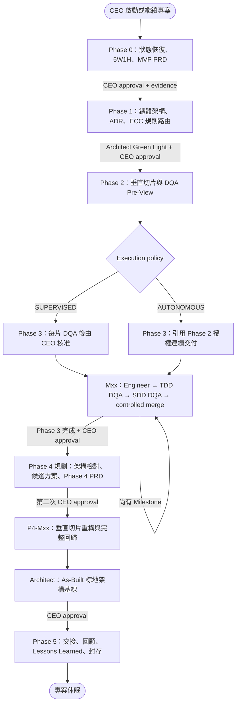

# Johnny Project Team — Codex Plugin

[](plugins/johnny-project-team-codex/.codex-plugin/plugin.json)
[](plugins/johnny-project-team-codex/LICENSE)

Johnny Project Team 把 CEO、PM、Architect、Engineer、TDD DQA 與 SDD DQA 組成有實體 gate 的 Codex 開發團隊。它以 Vibe Coding 的快速協作為入口，但用垂直切片、TDD、規格驗收、Git tree-bound evidence 與明確核准權限制衡。

## 核心設計理念：邏輯與工程分工

- CEO 決定意圖、範圍、風險接受度與授權方式。
- PM 管理 PRD、scope contract、Milestone、Context Pack、核准與 controlled merge，不代替 Engineer 寫產品程式。
- Architect 定義系統邊界與 ADR，Phase 4 再檢討 Phase 3 程式並撰寫詳細 As-Built。
- Engineer 在 `src/` 以 RED → GREEN → REFACTOR 完成單一垂直切片。
- TDD DQA 先驗證行為與回歸；SDD DQA 後驗證 intent、non-goals、UX 與規格。
- Repository-local hooks 將核准、branch、staged tree 與 DQA evidence 變成可執行規則。

## Phase 0～5 工作流程


```mermaid
flowchart TD
    Start([CEO 啟動或繼續專案]) --> P0["Phase 0：狀態恢復、5W1H、MVP PRD"]
    P0 -->|CEO approval + evidence| P1["Phase 1：總體架構、ADR、ECC 規則路由"]
    P1 -->|Architect Green Light + CEO approval| P2["Phase 2：垂直切片與 DQA Pre-View"]
    P2 --> Policy{"Execution policy"}
    Policy -->|SUPERVISED| P3S["Phase 3：每片 DQA 後由 CEO 核准"]
    Policy -->|AUTONOMOUS| P3A["Phase 3：引用 Phase 2 授權連續交付"]
    P3S --> Loop["Mxx：Engineer → TDD DQA → SDD DQA → controlled merge"]
    P3A --> Loop
    Loop -->|尚有 Milestone| Loop
    Loop -->|Phase 3 完成 + CEO approval| P4Plan["Phase 4 規劃：架構檢討、候選方案、Phase 4 PRD"]
    P4Plan -->|第二次 CEO approval| P4Build["P4-Mxx：垂直切片重構與完整回歸"]
    P4Build --> AsBuilt["Architect：As-Built 棕地架構基線"]
    AsBuilt -->|CEO approval| P5["Phase 5：交接、回顧、Lessons Learned、封存"]
    P5 --> End([專案休眠])
```

### Phase 0：狀態恢復與需求收斂

PM 先讀實際 `.johnny/state.json`、Save State 與現有 PRD。全新專案才建立 `src/` 骨架並啟用 repository。使用 `5w1h-grill-me` 進行三輪需求盤問，產出 5W1H Digest、MVP、User Flow、必要的 wireframe／視覺方向、Model Matrix 與 `PM/PRD/PRD.md`。CEO 核准前不得進入架構設計。

### Phase 1：總體架構與規則路由

Architect 依核准 PRD 定義 module、interface、資料／控制流、外部整合、技術選型、System Flow 與 ADR。架構只固定真正重要的邊界，避免把微觀實作誤列為規格。Architect Green Light 與 CEO 核准後，建立精確的 ECC common／language／framework selection。

### Phase 2：Milestone 與開工方式

PM 將工作拆成一對一 `Mxx` Ticket／Milestone，每片都必須可獨立展示與測試，禁止只切 DB、API 或 UI。TDD／SDD DQA 進行 Pre-View 後，CEO 選擇：

- `SUPERVISED`：每片 TDD、SDD PASS 後仍須 CEO 核准。
- `AUTONOMOUS`：Phase 2 一次授權；DQA PASS 後 PM 可引用該授權繼續。

兩者的品質門檻相同；FIXED 衝突、第五次同角色 FAIL、範圍變更與高風險外部動作仍須 CEO 決策。

### Phase 3：實作與驗收雙迴圈

一次只啟動一個 dependency-ready `codex/milestone-Mxx`。Engineer 載入架構、Milestone PRD、Task Context Pack、scope contract、TDD 指引與 ECC rules，只 commit `src/**`。完成後必須執行 smoke test（無獨立入口時做最接近 probe），並將修改明細、測試、工具、非預期失敗與流程觀察寫入 `Engineer/` 的 versioned Handoff；可參考內建 one-shot。只有 PM 能把 smoke PASS 的同一 tree 依序路由給 TDD DQA、SDD DQA。SDD FAIL 或產品變更會開新 review cycle。核准後只能透過 `johnny_pm_merge.py` 合併。

TDD／SDD DQA 使用獨立 review report，並只能在非 production、可重建、可清理的環境驗證。每個產品 Ticket 至少包含有界 stress／load／soak 或 monkey／fuzz 韌性測試；受控實際硬體可以使用，但必須具安全 envelope、emergency stop、非 production backend 與前後狀態證據。無法安全隔離時回報 `BLOCKED_ENVIRONMENT`，不得以未隔離結果 PASS。

### Phase 4：架構深化與棕地基線

進入 Phase 4 只代表可以規劃，尚不能修改產品程式。Architect 使用 `improve-codebase-architecture` 檢討 Phase 3 code。專案不需要預先存在 `CONTEXT.md`；Architect 從 AGENTS、README、manifests、PRD、ADRs、tests、Git history、interfaces、schemas 與 runtime config 重建 `Architect/Phase4_Codebase_Context.md`。

CEO 選定改善方向後，Architect 固化 review，PM 產出 `PM/PRD/Phase4_PRD.md` 與 `P4-Mxx` 垂直切片。第二次 CEO approval 由 `johnny_phase4_start.py` 解鎖實作。每片仍走 TDD → SDD；完整 Phase 3 回歸通過後，由 Architect 撰寫 `Architect/As_Built_Architecture.md`。

### Phase 5：交接與封存

PM 彙整 As-Built、Handover Manual、已知限制、技術債、Lessons Learned 與 scope-quality retrospective，確認沒有未完成 Milestone、DQA escalation、憑證交接或外部相依後封存專案。Phase 5 不再修改產品行為。

## 實體防護

- `.johnny/enabled.json` 將 gate 限定在明確啟用的 repository。
- `core.hooksPath=.johnny/git-hooks` 不修改 global Git config。
- Phase 3 使用 `codex/milestone-Mxx`；Phase 4 使用 `codex/phase4-Mxx`。
- Construction commit 只能包含 `src/**`。
- DQA verdict 綁定 stable ticket、review cycle、`subject_tree`、`commit_tree` 與 ECC selection hash。
- 同一 Milestone、同一 DQA role 第五次 FAIL 會凍結並升級 CEO。
- Claude DQA 與 Security DQA 是手動選用。Log Agent 預設啟用為非 gate observability；PM 只在有界 evidence 可用時派工，SessionStart 與 Git hooks 不得自動啟動它。

## 角色與目錄隔離

```text
<project>/
├─ src/                         # 唯一產品交付根目錄
│  ├─ app/
│  ├─ tests/                   # Engineer 維護的永久測試
│  ├─ config/
│  ├─ migrations/
│  └─ scripts/
├─ PM/                         # PRD、Context、Milestones、Changes
├─ Engineer/                   # 每個 review cycle 的 Engineer Handoff 報告
├─ Architect/                  # Architecture、ADR、Phase 4 context、As-Built
├─ TDD_DQA/{tool,evidence}/
├─ SDD_DQA/{tool,evidence}/
├─ Claude DQA/{tool,evidence}/
├─ Logs/
├─ .johnny/                    # state、config、evidence、repository hooks
└─ .agents/                    # context manifest、lessons
```

DQA 可以在自己的 `tool/` 建立隔離檢查，但不得修改 `src/`。值得永久保留的回歸測試由 Engineer 審查後移入 `src/tests/`。TE 始終唯讀。

## 依賴與前置需求

- OpenAI Codex Desktop／CLI 與 plugin support。
- Git。
- 可用 Python runtime；Windows hook 依序使用 `CODEX_PYTHON`、`py -3`、`python3`、`python`。
- 專案技術棧所需 runtime／build tools。
- 選用：Claude CLI、外部瀏覽器或 UI 測試工具。

### 外部 skills 與 OmniParser

本 plugin 不封裝 `grilling`、`codebase-design`、
`improve-codebase-architecture` 或 OmniParser。使用者必須從團隊核准的來源，
將三個 skills 分別安裝到 `$CODEX_HOME/skills/<skill-name>/SKILL.md`；安裝後可用
下列 PowerShell 指令確認：

```powershell
@('grilling', 'codebase-design', 'improve-codebase-architecture') |
  ForEach-Object { Test-Path "$env:CODEX_HOME\skills\$_\SKILL.md" }
```

UI DQA 預設先審查實際截圖。只有截圖證據不足以精準判定時，才需要依
[Microsoft OmniParser](https://github.com/microsoft/OmniParser) 官方說明另行下載、
安裝並設定 runner。若當次審查需要 OmniParser 但環境尚未安裝，SDD DQA 必須回報
`BLOCKED_DEPENDENCY`，不得以降低解析度或驗證標準代替。

任何 GitHub 工具在下載或啟用前都必須完成安全、授權與相容性審核。

## 安裝

在 repository root 執行：

```powershell
codex plugin marketplace add .
codex plugin add johnny-project-team-codex@johnny-project-team-github
codex plugin list
```

全新專案：

```powershell
python <plugin-root>\skills\johnny-project-team\scripts\johnny_new_project.py `
  --project <new-project-path> --name "<product-name>"
```

檢查內容並建立 baseline commit 後啟用：

```powershell
python <plugin-root>\skills\johnny-project-team\scripts\johnny_project_hooks.py `
  enable --project <project-path>
```

既有專案升級：

```powershell
python <plugin-root>\skills\johnny-project-team\scripts\johnny_project_hooks.py `
  migrate --project <project-path>
```

狀態檢查與完整初始化：

```powershell
python <plugin-root>\skills\johnny-project-team\scripts\johnny_project_hooks.py status --project <project-path>
python <plugin-root>\skills\johnny-project-team\scripts\johnny_initialize.py --project <project-path> --paths src\feature.tsx
```

更完整的命令契約見 [INSTALLATION.md](docs/INSTALLATION.md)、[WORKFLOW.md](docs/WORKFLOW.md) 與 skill 內的 `references/script-catalog.md`。
