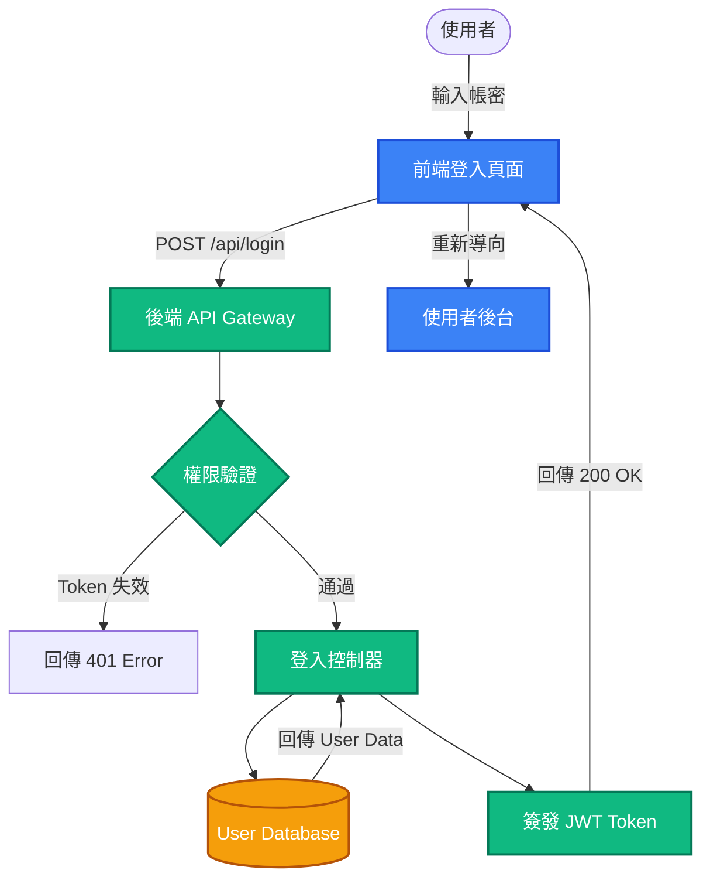
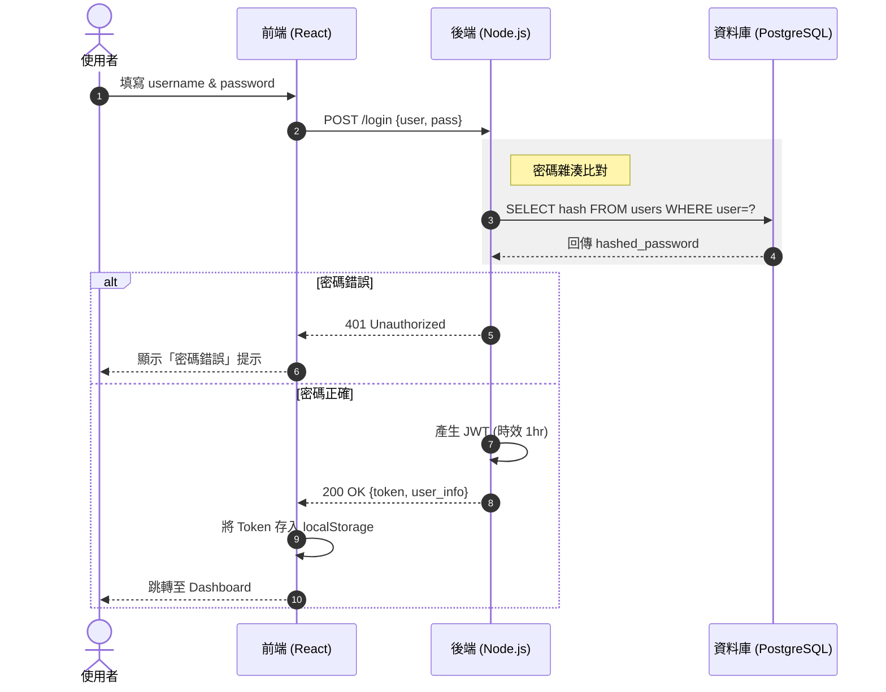

# M1: 登入模組 (Login Module) 視覺化報告

> [!NOTE]
> 這是 PM 在 Milestone 結束後，自動產出給 CEO 審查的範例報告。

## 1. 系統流程圖 (System Flow)
展示了前端送出請求後，系統內部的驗證路由與元件呼叫關係。

```mermaid
graph TD
    %% 節點定義
    User([使用者]) -->|輸入帳密| UI[前端登入頁面]
    UI -->|POST /api/login| API[後端 API Gateway]
    
    API --> AuthMiddleware{權限驗證}
    AuthMiddleware -->|Token 失效| Error[回傳 401 Error]
    AuthMiddleware -->|通過| AuthController[登入控制器]
    
    AuthController --> DB[(User Database)]
    DB -->|回傳 User Data| AuthController
    
    AuthController --> JWT[簽發 JWT Token]
    JWT -->|回傳 200 OK| UI
    UI -->|重新導向| Dashboard[使用者後台]

    %% 樣式美化
    classDef ui fill:#3b82f6,stroke:#1d4ed8,stroke-width:2px,color:#fff;
    classDef backend fill:#10b981,stroke:#047857,stroke-width:2px,color:#fff;
    classDef database fill:#f59e0b,stroke:#b45309,stroke-width:2px,color:#fff;
    
    class UI,Dashboard ui;
    class API,AuthMiddleware,AuthController,JWT backend;
    class DB database;
```

## 2. 資料流向圖 (Data Flow)
精確展示元件之間的時間序列與資料傳遞內容。

```mermaid
sequenceDiagram
    autonumber
    actor U as 使用者
    participant F as 前端 (React)
    participant B as 後端 (Node.js)
    participant D as 資料庫 (PostgreSQL)

    U->>F: 填寫 username & password
    F->>B: POST /login {user, pass}
    
    rect rgb(240, 240, 240)
        note right of B: 密碼雜湊比對
        B->>D: SELECT hash FROM users WHERE user=?
        D-->>B: 回傳 hashed_password
    end

    alt 密碼錯誤
        B-->>F: 401 Unauthorized
        F-->>U: 顯示「密碼錯誤」提示
    else 密碼正確
        B->>B: 產生 JWT (時效 1hr)
        B-->>F: 200 OK {token, user_info}
        F->>F: 將 Token 存入 localStorage
        F-->>U: 跳轉至 Dashboard
    end
```
