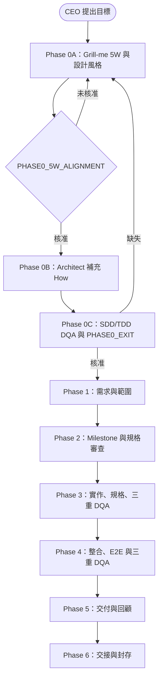

# Johnny Project Team Plugin（Codex 版）

以 Codex 原生協作為核心的多代理專案治理 Plugin。它把產品探索、CEO 核准、架構設計、工程實作、DQA 審查與完整可追溯 Log 串成可驗證、預設 fail-closed 的流程。

> 本資料夾是 Codex 版本。原始 Antigravity 版本位於倉庫根目錄的 [`../antigravity/`](../antigravity/)；兩者可獨立安裝，請勿混用其設定與 Hook。

---

## 核心理念

- **先釐清產品，再決定技術。** Phase 0 先由 Grill-me 引導 CEO 回答 5W 與希望的設計風格；未完成 `PHASE0_5W_ALIGNMENT` 前，不得派遣 Architect 或產出正式 How。
- **核准必須可追溯。** Approval Ledger 綁定 scope、Phase、Milestone、產物路徑與 SHA-256；單純 `/approve` 字串不構成有效授權。
- **Gate 預設拒絕。** 遺漏產物、Schema、DQA 證據、核准或前序 Phase 關閉狀態時，Gate 會列出缺失並阻擋推進。
- **角色責任要清楚。** PM 協調；Architect 只在核准後補充 How；Engineer 實作；DQA 自行測試、蒐證並判定品質。
- **完整歷史不可被摘要取代。** JSONL Log 保留命令、證據、trace ID、stdout/stderr、例外、重試與敏感資料遮罩；狀態摘要僅作為查閱入口。

---

## 開發工作流



### 詳細 Phase 流程

| Phase | 主要工作 | 必要 Gate／產物 |
| --- | --- | --- |
| 0A | PM 使用 Grill-me 協助 CEO 對齊 Why、Who、What、Where、When-Action 與希望的設計風格。 | `PM/Phase0_5W_Alignment.md`、`PHASE0_5W_ALIGNMENT` |
| 0B | Architect 依已核准 5W 補充可追溯的 How。 | `Architect/Phase0_How_Architecture_Draft.md` |
| 0C | SDD DQA、TDD DQA 驗證 5W1H、風險、可測試性與可觀測性。 | `PHASE0_EXIT` |
| 1 | 整理產品範圍、Non-goals、驗收方向與前序風險。 | 前一 Phase 正式關閉 |
| 2 | 規劃大／小 Milestone；每個小 Milestone 擁有獨立規格、測試與核准。 | `M1.1` 等 Milestone 狀態與 Gate |
| 3 | 以核准規格實作，DQA 依 TDD、SDD、Claude 順序自行測試與審查。 | DQA 指紋、測試證據、正確範圍核准 |
| 4 | 執行整合、E2E、安全、異常與邊界驗證，DQA 依 TDD、SDD、Claude 順序進行。 | 完整測試報告與三重 DQA（適用時） |
| 5 | 交付、Release 準備、經驗整理與未解風險回報。 | Gate 與核准紀錄 |
| 6 | 交接、保存完整歷史與 Lessons Learned。 | Handover 與保存狀態 |

---

## 核心功能

### 1. Phase 0 Grill-me 與 5W1H 對齊

Grill-me 不是技術設計會議。它會協助 CEO 和 PM 明確記錄產品目的、使用者、範圍、部署邊界、例外行為與視覺／體驗偏好。技術選型與架構只可在 5W 核准後於 Phase 0B 進行。

### 2. Approval Ledger 與語意失效

`PM/Approval_Ledger.json` 是 append-only Ledger。每筆核准包含 `approval_id`、scope、Phase／Milestone、產物 SHA-256、核准者、時間、狀態、失效原因與對應 Gate。

- 語意變更會使相關核准、DQA 結論及下游產物轉為 `STALE`。
- 純排版變更可維持核准，但必須留下判定證據。
- `--auto`、預設同意、模糊 `/approve` 與舊 hash 一律被拒絕。

### 3. 大／小 Milestone 與隔離規格

小 Milestone 使用 `M1.1`、`M1.2` 格式。超過五個小 Milestone 時，流程要求採大／小階層；每個小 Milestone 都有獨立的：

```text
specs/<milestone-id>/sdd_spec.md
specs/<milestone-id>/tdd_spec.md
specs/<milestone-id>/approval.json
specs/<milestone-id>/injection_manifest.json
```

這可避免共用規格檔被覆寫，並保留 Context Injection 的來源、SHA-256、角色、編碼、時間與結果。

### 4. DQA 與測試完整性

- Phase 3 與 Phase 4 固定依 TDD DQA、SDD DQA、Claude DQA 的順序進行三重審查；前一項未 PASS 不得開始下一項。
- TDD DQA 預設使用 `High` reasoning。
- DQA 自行執行所負責的測試並將證據寫入正式 DQA 報告；不建立或派遣額外測試代理。
- Phase 3 的 SDD／TDD DQA 合併唯一 `test_case_id` 上限為 30；Phase 4 為 50。超出時不得刪減測試，必須取得 PM 對具體清單的 `phase_test_expansion` 核准。
- 未執行、受阻與失敗必須分別記錄，不能標示為 PASS。

### 5. Claude DQA 的安全邊界

Claude DQA 是外部、唯讀審查節點。Plugin **不會自動呼叫** Claude CLI。

只有同時符合下列條件才可執行：

1. CEO 已在 Ledger 建立對應 Phase 的 `external_service_cost` 核准。
2. 明確提供該 `cost-approval-id` 與 `--execute`。
3. Claude CLI 可用，且以唯讀／plan 類權限執行。

任一條件不滿足時，Gate 會阻擋並保留缺失，不會偽造 PASS。

### 6. 單一狀態與完整可觀測性

`.agents/project_state.json` 是單一權威狀態，記錄目前 Phase、大小 Milestone、核准、STALE 項目、DQA／Engineer 狀態、blocker、下一步與報告位置。

完整 JSONL Log 會記錄時區時間、角色、correlation ID、命令、工具版本、環境、stdout/stderr、例外、重試、Gate 轉換與證據位置，並遮罩 Token、密碼、個資與敏感附件內容。

### 7. Windows 與 UTF-8 相容性

治理腳本以 UTF-8 讀寫並提供 Unicode-safe 輸出。直譯器偵測會依序檢查 Codex bundled Python、`python`、`python3`、`py`，避免把 PATH 問題誤判為未安裝 Python。

---

## 前置條件

### 必要條件

1. 支援本機 Plugin 的 Codex 環境。
2. Python 3；建議使用 Codex bundled Python。
3. Git（僅在你要自行管理此 Plugin 原始碼時需要）。

### 選用條件

- Claude CLI：只在你已核准外部成本，且需要 Claude DQA 時使用。
- Docker 或專案特定測試工具：僅依 DQA 指派的測試環境需求安裝。

---

## Skill 安裝需求

### 一般使用者

安裝整個 `codex/` Plugin 後，以下 Skill 會隨 Plugin 一起載入，**不需要逐一另外下載或安裝**。在 Codex 介面中，名稱可能會顯示為 `johnny-project-team-plugin:<skill-name>`。

| Skill | 必要性 | 用途 |
| --- | --- | --- |
| [`johnny-project-team`](skills/Johnny-project-team/SKILL.md) | **必要，主要入口** | 由目前 Codex task 擔任 PM，管理 Phase 0～6、CEO 核准、Milestone、角色派遣與 Gate。 |
| [`team-constitution`](skills/team-constitution/SKILL.md) | 建議啟用 | 建立與維護角色責任、協作規則、品質門檻及安全邊界。 |
| [`codex-executor-orchestrator`](skills/claude-executor-orchestrator/SKILL.md) | 多代理工作時需要 | 把工作拆成 Codex 原生子任務，追蹤、等待、追加或中斷代理工作。 |
| [`lesson-maintainer`](skills/lesson-maintainer/SKILL.md) | 使用 Lessons Learned 時需要 | 整理、去重與歸納 `.agents/lessons_learned/` 的經驗資料。 |
| [`claude-dqa`](skills/claude-dqa/SKILL.md) | 選用 | 管理 Phase 3／4 的外部 Claude DQA 唯讀審查及成本核准檢查。 |

### Grill-me 是否需要另外安裝？

不需要。此 Plugin 已把 Grill-me 問答協議內建於 [`grill-me-phase0.md`](skills/Johnny-project-team/references/grill-me-phase0.md)，並由 `johnny-project-team` 在 Phase 0A 路由使用。若環境另外裝有同名 Grill-me Skill，可作為提問輔助，但仍必須遵守本 Plugin 的 5W、Approval Ledger 與 Phase Gate 規則。

### 維護者才需要的 Skill

下列 Skill 只在修改或重新封裝此 Plugin 時使用；一般專案執行不需要：

- `skill-creator`：修改 `SKILL.md`、references 或資源路由時，用於檢查 Skill 結構。
- `plugin-creator`：修改 `.codex-plugin/plugin.json`、Plugin 目錄或封裝設定時，用於驗證 manifest。

### 外部工具不是 Skill

- **Claude CLI**：選用的外部工具，不會隨 Plugin 安裝。只有 CEO 已建立對應 `external_service_cost` Ledger 核准時才能執行。
- **Python**：治理腳本的執行環境；優先使用 Codex bundled Python。
- **Git／Docker／專案測試工具**：只在對應工作流或 DQA 測試命令需要時安裝。

### 安裝後確認

1. 以 `codex/` 為 Plugin 根目錄完成安裝。
2. 重新開啟一個 Codex task，讓 Plugin 與 Skill 清單重新載入。
3. 確認至少能看到 `johnny-project-team`；需要多代理、Lessons Learned 或 Claude DQA 時，再確認對應內附 Skill 可用。
4. 啟動專案時先使用 `johnny-project-team`，讓 PM 從 Phase 0A Grill-me 開始，不要直接跳到 Engineer 或 DQA。

---

## 安裝與啟動

1. 在 Codex 的 Plugin 管理介面選擇本資料夾 `codex/` 作為 Plugin 根目錄；manifest 位於 `.codex-plugin/plugin.json`。
2. 在新專案中啟用 `johnny-project-team` Skill。
3. 告訴 PM 你的產品目標。PM 會先進入 Phase 0A，以 Grill-me 協助你完成 5W 與設計風格對齊。
4. PM 顯示明確核准範圍、產物與 hash 後，再由 CEO 進行核准；不要以模糊訊息取代範圍核准。

常用治理指令範例：

```powershell
python skills/Johnny-project-team/scripts/project_governance.py init --project-dir <project>
python skills/Johnny-project-team/scripts/project_governance.py approve --help
python skills/Johnny-project-team/scripts/project_governance.py gate --help
```

---

## 測試與驗證

在 `codex/` 目錄執行：

```powershell
python -m unittest discover -s tests -v
python <skill-creator>/scripts/quick_validate.py skills/Johnny-project-team
python <plugin-creator>/scripts/validate_plugin.py .
```

若 Windows 預設為 CP950，請以 UTF-8 模式執行外部驗證器：

```powershell
$env:PYTHONUTF8 = '1'
python -X utf8 <skill-creator>/scripts/quick_validate.py skills/Johnny-project-team
```

完整測試亦涵蓋 Ledger、Gate、Milestone 隔離、語意／排版 stale、DQA 測試證據、Log 遮罩、Unicode、interpreter 偵測、Hook 重跑與 Phase 0 forward test。

---

## 目錄結構

```text
codex/
├─ .codex-plugin/plugin.json       # Codex Plugin manifest
├─ agents/                         # 角色設定 Schema
├─ skills/
│  └─ Johnny-project-team/
│     ├─ SKILL.md                  # 核心流程與資源路由
│     ├─ references/               # Phase、Gate、Log、DQA 規格
│     ├─ scripts/                  # 可重複執行的治理與驗證工具
│     └─ tests/                    # Plugin 專屬測試
└─ tests/                          # 治理整合測試
```

---

## 授權

MIT；詳見 [LICENSE](LICENSE)。
