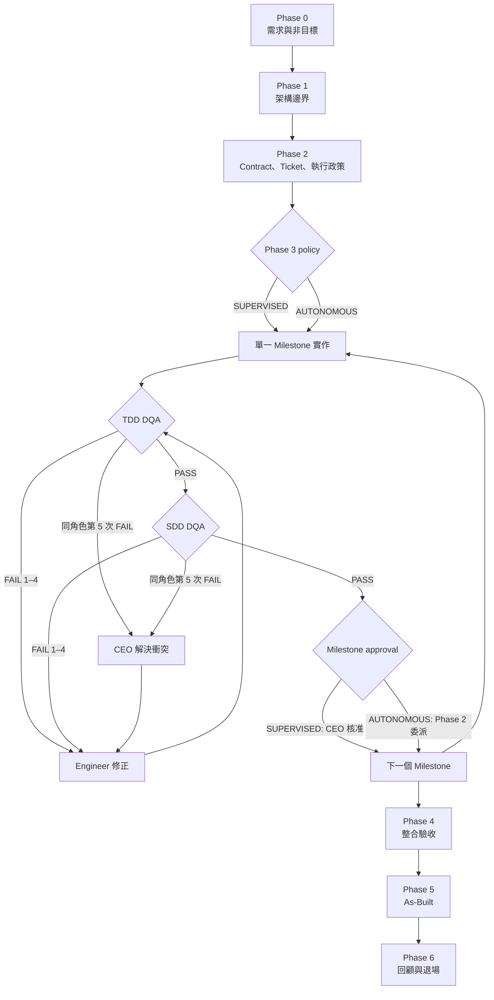

# Johnny Project Team — Codex Edition

[](https://openai.com/codex/)
[](plugins/johnny-project-team-codex/.codex-plugin/plugin.json)
[](plugins/johnny-project-team-codex/LICENSE)

這是 Johnny Project Team 的 OpenAI Codex 原生版本。它與 Repository 根目錄的
Antigravity Edition 分開維護，使用 Codex Plugin manifest、lifecycle hooks、
Skills 與 TOML Agent profiles。

## 版本邊界

| 項目 | Codex Edition | Antigravity Edition |
|---|---|---|
| 位置 | `codex/` | Repository 根目錄 |
| Manifest | `.codex-plugin/plugin.json` | `plugin.json` |
| Agent profiles | `.codex/agents/*.toml` | `agents/*.json` |
| Hooks | `SessionStart`、`SubagentStart`、`PreToolUse` | Antigravity hooks |
| Git gate | Repository-local `.johnny/git-hooks` | Antigravity gate scripts |

不要將兩個版本複製到同一個 Plugin 安裝位置，也不要互換 Hook 設定。

## 核心能力

- Phase 0–6 專案工作流與明確 Phase gate。
- 一個 Ticket 對應一個小 Milestone。
- `FIXED`、`CONTROLLED`、`DISCRETIONARY` 三層 Scope Contract。
- 每個 Milestone 依序通過 TDD DQA 與 SDD DQA。
- DQA 證據綁定 Git `subject_tree`、`commit_tree` 與 review cycle。
- Repository-local Git hooks，不修改全域 Git 設定。
- Claude DQA、Security DQA 與 Log Agent 均為選用、手動啟動。
- Phase 3 支援：
  - `SUPERVISED`：CEO 逐 Milestone 核准。
  - `AUTONOMOUS`：Phase 2 一次委派，DQA 全數 PASS 後自動成立 Milestone approval。
- 同一 Milestone、同一 DQA 角色前四次 FAIL 退回工程師修正；第五次凍結並提交 CEO。

## 工作流摘要


```mermaid
flowchart TD
    P0["Phase 0\n需求與非目標"] --> P1["Phase 1\n架構邊界"]
    P1 --> P2["Phase 2\nContract、Ticket、執行政策"]
    P2 --> Policy{"Phase 3 policy"}
    Policy -->|SUPERVISED| Build["單一 Milestone 實作"]
    Policy -->|AUTONOMOUS| Build
    Build --> TDD{"TDD DQA"}
    TDD -->|FAIL 1–4| Fix["Engineer 修正"]
    Fix --> TDD
    TDD -->|PASS| SDD{"SDD DQA"}
    SDD -->|FAIL 1–4| Fix
    TDD -->|同角色第 5 次 FAIL| CEO["CEO 解決衝突"]
    SDD -->|同角色第 5 次 FAIL| CEO
    CEO --> Fix
    SDD -->|PASS| Gate{"Milestone approval"}
    Gate -->|SUPERVISED: CEO 核准| Next["下一個 Milestone"]
    Gate -->|AUTONOMOUS: Phase 2 委派| Next
    Next --> Build
    Next --> P4["Phase 4\n整合驗收"]
    P4 --> P5["Phase 5\nAs-Built"]
    P5 --> P6["Phase 6\n回顧與退場"]
```

## 快速安裝

從 Repository 根目錄執行：

```powershell
codex plugin marketplace add .\codex
codex plugin add johnny-project-team-codex@johnny-project-team-github
codex plugin list
```

macOS 或 Linux：

```bash
codex plugin marketplace add ./codex
codex plugin add johnny-project-team-codex@johnny-project-team-github
codex plugin list
```

安裝或更新後請開啟新的 Codex task。首次執行或 Hook 內容更新時，請先檢視
Codex 顯示的 Hook trust 提示再決定是否允許。

完整步驟請見 [安裝指南](docs/INSTALLATION.md)。

## 啟用專案

目標專案必須先有乾淨的 initial commit：

```powershell
python <plugin-root>\skills\johnny-project-team\scripts\johnny_project_hooks.py `
  enable --project <project-path>
```

啟用只會設定該 Repository 的
`core.hooksPath=.johnny/git-hooks`，不會修改全域 Git configuration。

檢查狀態：

```powershell
python <plugin-root>\skills\johnny-project-team\scripts\johnny_project_hooks.py `
  status --project <project-path>
```

## 文件

- [安裝與更新](docs/INSTALLATION.md)
- [Phase 與 DQA 工作流](docs/WORKFLOW.md)
- [從 Antigravity Edition 遷移](docs/MIGRATION_FROM_ANTIGRAVITY.md)
- [貢獻指南](CONTRIBUTING.md)
- [安全政策](SECURITY.md)
- [更新紀錄](CHANGELOG.md)
- [正式腳本用途目錄](plugins/johnny-project-team-codex/skills/johnny-project-team/references/script-catalog.md)

## Repository 結構

```text
codex/
├── .agents/plugins/marketplace.json
├── README.md
├── docs/
└── plugins/
    └── johnny-project-team-codex/
        ├── .codex-plugin/plugin.json
        ├── hooks/
        └── skills/
```

## 授權

Codex Edition 採用 [MIT License](plugins/johnny-project-team-codex/LICENSE)。
